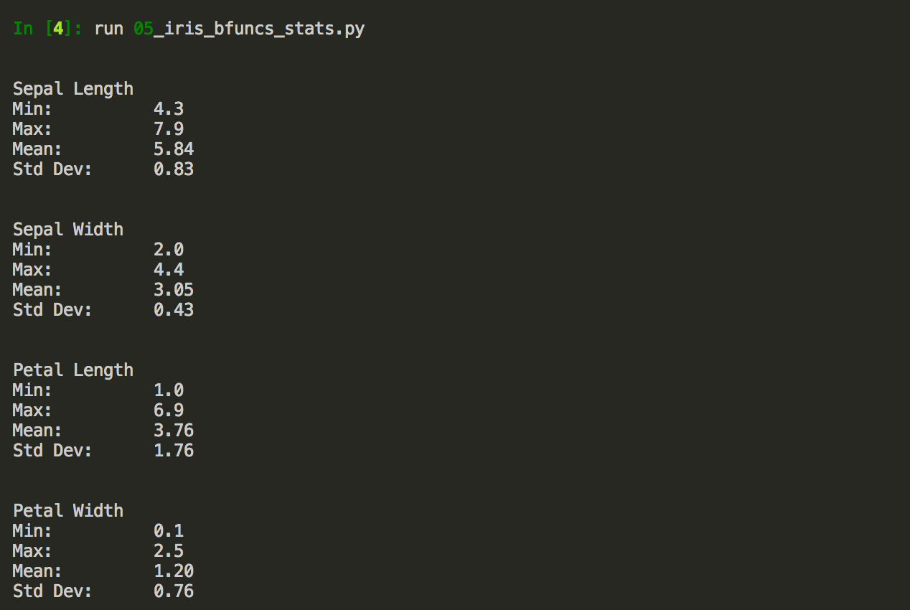

# 52167-Programming-and-Scripting-Final-Project
Final project submission for the 52167 Programming and Scripting on the GMIT Higher Diploma in Data Analytics 2018 Course

## SUMMARY

The Iris Data set consists of 150 data points representing the attributes recorded in samples of three classes of Iris flowers.  The data is used extensively in data analytics as a test case for many different applications from machine learning to graphical representation (1).  This paper will provide a detailed description of the data set, discuss the applications and provide some exploratory analysis of the data using python scripts.

The iris is a species of flowering plants found in the temperate northern hemisphere regions of Europe, Asia and North America.  The genus consists of up to 300  different species, they are a decorative flower commonly cultivated in gardens.  The plants are made up of a long free standing stem,  three drooping leaves or ‘sepals’ enclose the flower and the petals stand erect protecting the stigma. (2)

The Iris Flower Data set was created by Dr Edgar Anderson as part of his botanical studies into the irises of the Gaspe Peninsula and the species problem in Iris between 1935 and 1936 (3).  The information was then  made famous as a data set  by the eminent statistician Ronald Fisher in his 1936 paper “The Use of Multiple Measurements in taxonomic Problems”.  In this paper Fisher investigated ways in which Irises can be classified by their measurements and the linear relationships between those measurements.  He was successful in doing this and developed a linear discriminant model which was able to identify a class of iris from its measurements (4).

The data set consists of 150 data points separated into three sets of 50 by their species or class; iris – setosa, iris – virginica and iris – versicolor.  Each data point comprises four measurements; the sepal length, the sepal width, the petal length and the petal width.  The data set provides a good test case for data analytics as one class is linearly separable from the other two and those two are not linearly separable from each other (5).  Based on Fishers findings the Iris data set has become very popular as a test case for machine learning algorithms and statistical classification techniques (1).

As part of this summary some exploratory analysis has been conducted on the data set using the Python programming language to calculate statistical quantities and create graphical representations.  This was carried out using basic functions within Python to practice programming techniques as well as scripts that utilised the numpy, statistics, Matplotlib, Pandas and Seaborn libraries.

Scripts 01 to 05 use basic functions only to report various statistics on the data set.  The basis of these calculations is script 01 which performs an operation to create independent lists of the data fields.  The lists are declared and the append function is used to separate the data into sepal length, sepal width, petal length and petal width.  The lists are all indexed in the same way so data fields will correspond with each other.  Script 02 uses the python built in functions to calculate and report the max and min for each data field.  Script 03 includes a counter to keep a running total on the number of data fields in the data set.  This is then used with the built in sum function to calculate the mean, this is reported using the print function and rounded to 2 decimal places to match the published results.  Script 04 is used to calculate the standard deviation.  The data is imported and separated into lists, the first step is to calculate the mean for each list or data field, a for loop is then used to iterate through the list calculating the difference between each measurement and the mean, these differences are squared and a running total is calculated using the k and j variables.  The calculated total of the squared differences is divided by the number of fields and the square root calculated.  An integer value is returned so the float declaration is used in the calculation to  maintain precision.  The result is printed to the terminal screen and formatted to two decimal places.  The final script using basic functions only combines all scripts 01 to 04 to produce a statistical report for each data field.  In this case though the mean and standard deviation have been declared as functions and the calculations made as part of the print steps.  This greatly reduces the amount of code needed to calculate and report the statistics.  The output from script 05 can be seen below, the decimal places have been reported to reflect the accuracy of the results on the UCI data description page which has been used to independently check the calculations (6).

This results are based on the entire sample and do not differentiate between class of iris.  It can be seen that the sepals are generally considerably larger than the petals.  There is the most variance in the Petal length with a standard deviation of 1.76, this shows that in a normal distribution 69% of the sample will be within 1.76cm of the mean value.  The sepal length has a much smaller standard deviation of 0.43cm however this is explained by the smaller range.  It can also be seen that the petal width and sepal width have the same range of measurements of 2.4cm.

Script 06 uses the numpy and statistics libraries to produce a similar but more detailed report.  The csv file is imported using a numpy function ‘genfromtxt’ to produce a ndarray.  This is an array of homogenous numerical data so in this the case the class is not imported.  This is then subdivided into measurement type by indexing the data array.  Functions have been used from the statistics library and these have been formatted into the lines of print text to reduce the overall amount of code.  

![Output of a script using numpy and statistics libraries][Images/06 numpy.PNG]

In addition to the basic functions the mode, median and variance have been included in this report.  It can be seen that the petal length has the most variance in the measurements.  It should also be noted that there is a lot of variation in the mean, mode and median of the petal length whereas the other measurement types are more consistent.

Script 07 has been written using the matplotlib library to plot a histogram for each measurement.  The data is once again imported using a numpy function and then indexed into separate arrays based on measurement type.  The plt.hist function is used to create the plot and the majority of the script is used to configure the format of the output.  In this case a figure has been used with four subplots, the text size has been changed and each plot has been assigned a different colour.  

![Histogram displaying the distribution of Sepal Length, Sepal Width, Petal Length and Petal Width][07 matplotlib.PNG]

It can be seen by looking at the distribution of the plots that the petal length and petal widths are separated into two distinct groups of larger and smaller measurements, this may be a distinction between the classes.  The sepal measurements seem to be a lot more consistent and the sepal widths look a lot more like a normal distribution with the majority of measurements forming a notable peak with a few outliers at the extents.

The final script 08 utilises the high level libraries of pandas and seaborn to produce perhaps the most extensive statistical and graphical report in the least amount of code.  A pandas function is used to read the data into a pandas data frame, this is an array that can contain information of different data types.  An inbuilt function called describe is a able to produce a concise statistical report for each series in the data frame and this is printed out to the terminal screen.  The seaborn library has then been used to produce a facet grid scatter plot to visualise the petal length/petal width and sepal length/sepal width.  These are colour coded according to the class of iris.

![Repoprt using pandas 'describe' function][Images/08 report.PNG]

![Scatter plot of Petal length/Petal width][Images/08 scat petal.PNG]

![Scatter plot of Sepal length/Sepal width][Images/08 scat sepal.PNG]

These scatter plots reveal some distinctions between the classes of iris.  The petal measurements seem to follow a linear relationship i.e. the an increase in length results in a proportional increase in width.  All three classes show distinct clusters in the petal measurements and the iris setosa can easily be identified with its unique cluster of smaller measurements.  The iris virginica is clearly the larger flower and there is only a small crossover between that and the iris versicolor measurements.  

The sepal lengths on the other hand are more difficult to distinguish.  The iris setosa measurements are again clearly separated from the other two classes and follow linear relationship though the sepal dimensions seem to be close in length and width.  The distribution of the two other classes are mixed and it is a lot more difficult to separate these.  They seem to follow a relationship with the sepal length being almost twice the sepal width, it can also been seen that again the iris virginica sepals are generally larger than the iris versicolor but the majority of measurements are in the same region and largely indistinguishable.

## REFERENCES
1. Iris Flower data set. Wikipedia. [Online] [Cited: 04 20, 2018.] https://en.wikipedia.org/wiki/Iris_flower_data_set.
2. Iris (plant) wikipedia page. Wikipedia. [Online] [Cited: 04 29, 2018.] https://en.wikipedia.org/wiki/Iris_(plant).
3. The Use of Multiple Measurements in Taxonomic Problems. Fisher, R A. 1936.
4. Ronald Fisher Wikipedia Page. Wikipedia. [Online] [Cited: April 10, 2018.] https://en.wikipedia.org/wiki/Ronald_Fisher.
5. UCI. Iris Data Set. [Online] Center for Machine Learning and Intelligent Systems. [Cited: 04 26, 2018.] https://archive.ics.uci.edu/ml/datasets/iris.
6. Boschetti, Alberto and Massaron, Luca. Python Data Science Essentials. s.l. : Packt Publishing, 2015.
7. Church, James. Data Mining with Python: Implementing Classification and Regression. s.l. : Packt Publishing, 2016. 9781785885716.

## SCRIPTS

- Python 3.6.3 installation required, the Anaconda distribution was used
- Clone or download scripts from this repository
- Open Terminal window and run: python filepath/scriptname.py

1. 01_seperate_data_fields.py - used to seperate iris data set input into seperate lists: petal length; petal width; sepal length; sepal width

1. 02_max_min.py - calculates the maximum and minimum values of: petal length; petal width; sepal length; sepal width

1. 03_mean.py - calculates the mean values of: petal length; petal width; sepal length; sepal width

1. 04_stddev.py - calculates the standard deviation of each dat field

1. 05_iris_combined_stats.py - script using only python basic functions to report max, min, mean and standard deviation

